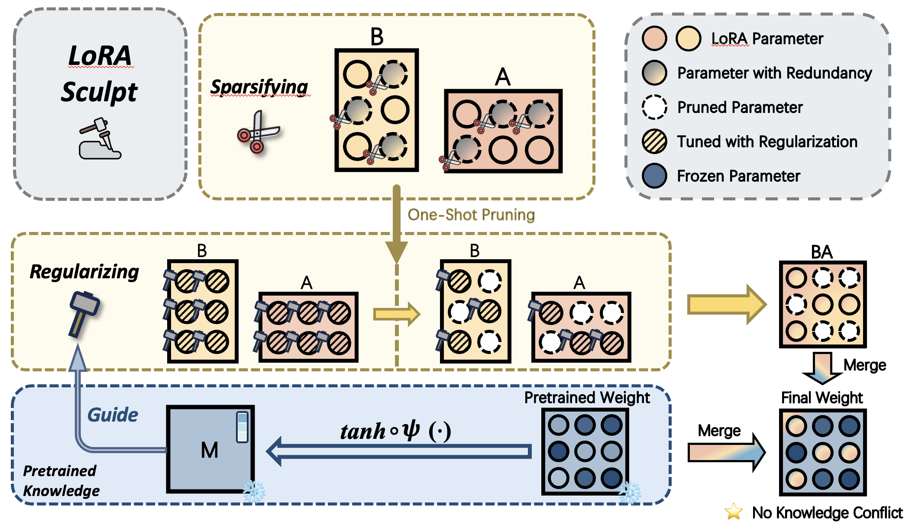

<h1 align="center">
  [CVPR'25 Oral] LoRASculpt: Sculpting LoRA for Harmonizing General and Specialized Knowledge in Multimodal Large Language Models  
</h1>

## News
* [2025-05] Repo created. Code will be released soon.
