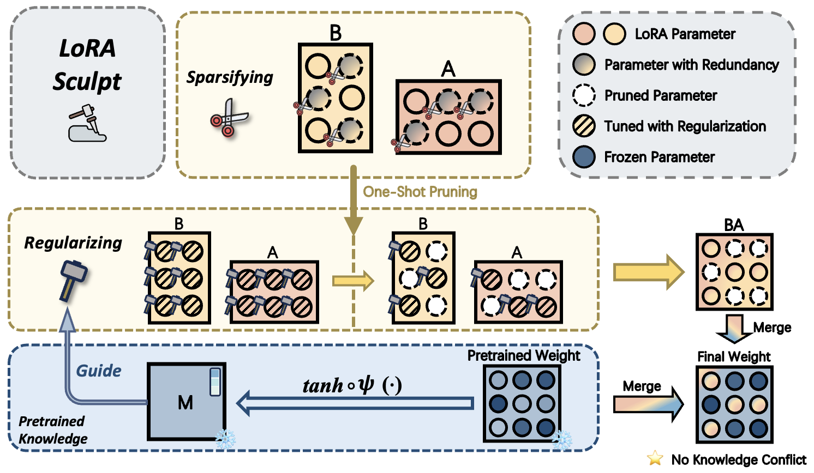

# LoRASculpt
[CVPR'25 Oral] LoRASculpt: Sculpting LoRA for Harmonizing General and Specialized Knowledge in Multimodal Large Language Models

<h1 align="center">
  LoRASculpt: Sculpting LoRA for Harmonizing General and Specialized  
  Knowledge in Multimodal Large Language Models  
  [CVPR'25 Oral]
</h1>

## News
* [2025-05] Repo created. Code will be released soon.
